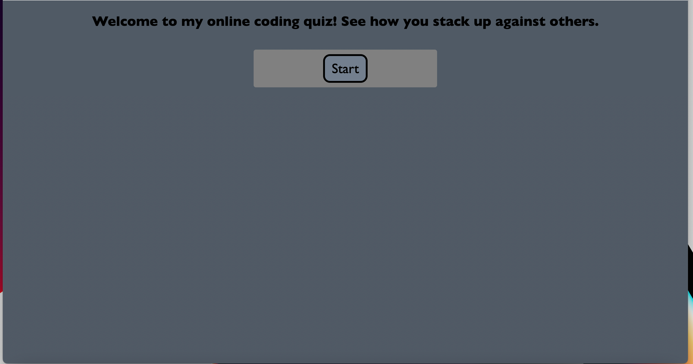

# Code-quiz

This weeks homework was building a coding quiz with multiple choices questions.

## Instructions 
1. Click start button to start the quiz
2. You will have 90 seconds to anwser 5 questions 
3. Each wrong anwser will reduce the time by 10 seconds 

## Technologies used
1. Javascript
2. CSS
3. HTML

https://github.com/Quinlan246/Code-quiz

https://quinlan246.github.io/Code-quiz/